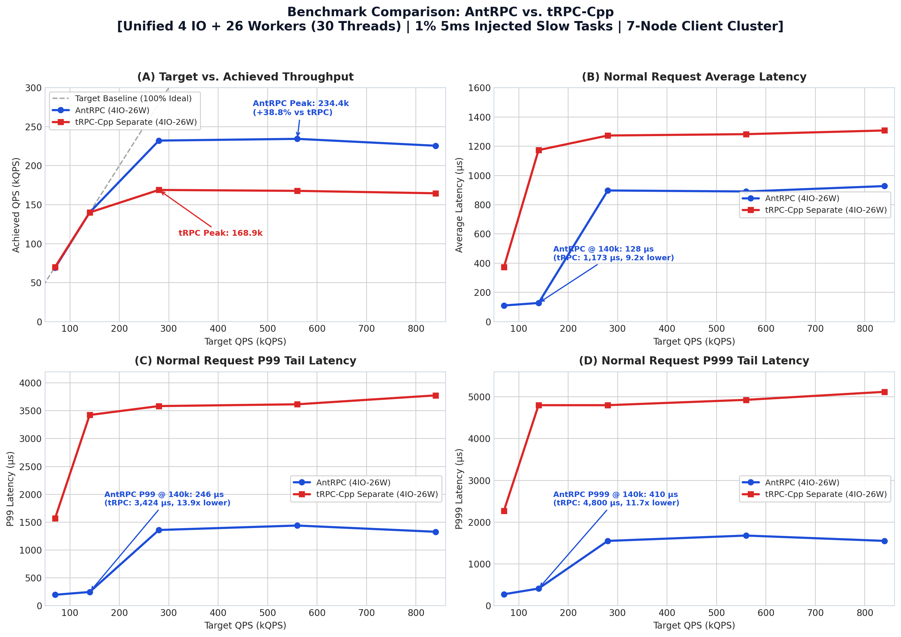
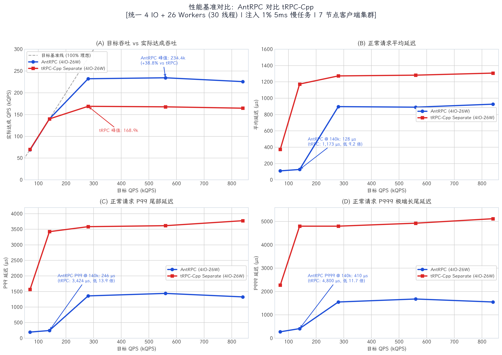

# AntRPC

[English](#english) | [中文](#中文)

<a id="english"></a>

## English

AntRPC is an experimental C++20 Protobuf unary RPC framework for Linux. It provides a Protobuf `RpcChannel` / `Service` programming interface, multiplexes concurrent requests over TCP, and decouples network I/O from service execution.

This project is intended for studying and evaluating RPC runtime architecture, rather than serving as a production drop-in replacement for bRPC or gRPC.

### Scope

- Protobuf reflection-based unary RPC with synchronous, callback, and coroutine-facing client channels.
- Versioned binary framing with correlation IDs, metadata, payload attachments, and frame length limits.
- Deadline enforcement, client-side cancellation, connection failure propagation, and race-free completion handling.
- Admission limits for concurrent connections, in-flight RPCs, and outbound socket buffers.
- Graceful shutdown (`Stop()` / `Join()`) and a loopback administrative endpoint for health and latency metrics.
- Out of scope: Streaming RPC, TLS, service discovery, client retries, and wire compatibility with gRPC/bRPC.

### Architecture

```text
                        Worker Pool (Executor)
                     +--------------------------+
                     |   Service Method Tasks   |
                     |  Work-stealing execution |
                     +------------+-------------+
                                  |
                           Completion Command
                      (Lock-free MPSC mailbox)
                                  |
Client TCP <-> Acceptor -> I/O Context -> ServerConnection
                        (Single-owner connection)
```

- **Multi-Reactor I/O:** Connections are accepted and assigned to dedicated `Context` event loops. Each connection is owned exclusively by one I/O thread.
- **Single-Owner Connections:** Connection state, TCP read/write buffers, and in-flight tracking are modified only by the owning I/O thread. Worker completions return via a lock-free MPSC command mailbox.
- **Outbound Batching:** Multiple outbound responses are merged into vectorized writes (`writev`) before flushing to reduce write system call overhead.
- **Execution Isolation (Separate Thread Model):** Parsed RPC calls execute on a worker pool. User service methods never run on I/O reactor threads, preventing blocking operations (e.g. synchronous database calls or disk I/O) from stalling network event loops.
- **Memory Allocation:** Integrates `mimalloc` to mitigate heap contention under high-concurrency cross-thread serialization and deserialization.

*Trade-off:* Compared to inline run-to-completion execution, decoupling network I/O from worker pools introduces inter-thread queue handoff and context-switching overhead under light workloads, but prevents slow tasks in service methods from stalling network reactor event loops.

### Quick Example

**Service Definition:**

```cpp
#include "ant_rpc/rpc/rpc_server.hpp"
#include "echo.pb.h"

class EchoServiceImpl final : public EchoService {
 public:
  void Echo(google::protobuf::RpcController* controller,
            const EchoRequest* request,
            EchoResponse* response,
            google::protobuf::Closure* done) override {
    response->set_message("Echo: " + request->message());
    if (done) done->Run();
  }
};
```

**Client Invocation:**

```cpp
#include "ant_rpc/rpc/channel.hpp"
#include "ant_rpc/rpc/controller.hpp"
#include "echo.pb.h"

ant_rpc::Scheduler scheduler{1, 1};
scheduler.Start();

ant_rpc::rpc::RpcChannel channel(scheduler.GetIOContext(0));
channel.Init("127.0.0.1", 8002);

EchoService_Stub stub(&channel);
ant_rpc::rpc::RpcController controller;
EchoRequest request;
EchoResponse response;
request.set_message("hello");

stub.Echo(&controller, &request, &response, nullptr);
if (!controller.Failed()) {
  // response.message() == "Echo: hello"
}
```

### Build & Test

Requirements: Linux, CMake 3.16+, C++20 compiler (GCC 10+ or Clang 12+).

```bash
# Release build (default epoll backend)
cmake -S . -B build -G Ninja -DCMAKE_BUILD_TYPE=Release
cmake --build build --parallel
ctest --test-dir build --output-on-failure

# Optional io_uring backend
cmake -S . -B build-uring -G Ninja -DCMAKE_BUILD_TYPE=Release -DANT_RPC_IO_BACKEND=io_uring
cmake --build build-uring --parallel

# ThreadSanitizer
cmake -S . -B build-tsan -G Ninja -DCMAKE_BUILD_TYPE=Debug -DANT_RPC_ENABLE_TSAN=ON
cmake --build build-tsan --parallel
ctest --test-dir build-tsan --output-on-failure
```

### Performance & Benchmark

The benchmark setup consists of a dedicated server node (32 vCPUs) and 7 client nodes generating distributed load over TCP. Benchmark results and raw logs are archived under [`results/`](results/).



#### Experimental Observations (`results/ant_rpc`, `results/trpc/separate`)

Both frameworks were benchmarked under identical thread allocations (4 IO threads + 26 Worker threads, 30 threads total) with 1% 5ms injected slow tasks across a 7-node client cluster:

- **Peak Throughput:** AntRPC reaches a peak capacity of **234.4k QPS**, outperforming tRPC-Cpp Separate (**168.9k QPS**) by **+38.8%**.
- **Latency & Tail Latency (at 140k QPS load):**
  - Average Latency: AntRPC **127.5 μs** vs. tRPC-Cpp Separate **1,173.2 μs** (**9.2× lower**).
  - P99 Tail Latency: AntRPC **246 μs** vs. tRPC-Cpp Separate **3,424 μs** (**13.9× lower**).
  - P999 Tail Latency: AntRPC **410 μs** vs. tRPC-Cpp Separate **4,800 μs** (**11.7× lower**).
- **Queuing & Saturation:** Under injected slow tasks, tRPC-Cpp Separate begins queuing from 140k QPS onwards, whereas AntRPC keeps flat latency curves until reaching saturation around 234k QPS.

Reproduction scripts are available in [`scripts/bench_blocking_stress.sh`](scripts/bench_blocking_stress.sh) and [`scripts/plot_benchmark.py`](scripts/plot_benchmark.py).

### Directory Layout

```text
include/ant_rpc/rpc/       RPC channel, protocol framing, controller, server
include/ant_rpc/scheduler/ I/O event loops, timer keeper, worker executor
include/ant_rpc/metrics/   Metrics counters, gauges, latency histograms
3rd_party/                 MPSC queue and mimalloc
proto/                     Protobuf service definitions
test/                      Unit, integration, and end-to-end tests
scripts/                   Benchmark automation and stress test scripts
results/                   Raw benchmark logs and metric outputs
doc/                       Protocol specification and performance charts
```

---

<a id="中文"></a>

## 中文

AntRPC 是一个面向 Linux 的实验性 C++20 Protobuf unary RPC 框架。项目提供标准 Protobuf `RpcChannel` / `Service` 接口，支持 TCP 连接上的并发多路复用，并将底层网络 I/O 与业务执行线程彻底解耦。

本项目主要用于学习与验证高性能 RPC 运行时架构设计，并非用于替代生产环境的 bRPC 或 gRPC。

### 功能范围

- 基于 Protobuf 服务反射的 Unary RPC 调用，支持同步、回调与协程接入。
- 二进制协议帧设计：包含 correlation ID、metadata、二进制 attachment、帧长校验及网络字节序编码。
- 超时控制（Deadline）、客户端取消（Cancellation）、连接故障传播，以及响应/取消/超时并发竞争下的 exactly-once 语义。
- 服务端反压限制：连接数上限、并发 in-flight 上限及单连接出站缓冲区阈值。
- `Stop()` / `Join()` 优雅停机，以及本地管理端点（暴露健康检查与延迟监控指标）。
- 非目标特性：暂不支持 Streaming RPC、TLS 加密、服务发现、自动重试，亦不兼容 gRPC/bRPC 协议报文。

### 核心架构

```text
                       工作线程池 (Executor)
                     +--------------------------+
                     |    业务 Service Method   |
                     |  Work-stealing 任务窃取  |
                     +------------+-------------+
                                  |
                             完成响应命令
                        (无锁 MPSC Mailbox)
                                  |
客户端 TCP <-> Acceptor -> I/O Context -> ServerConnection
                         (单线程归属连接模型)
```

- **多 Reactor I/O：** 连接接入后分配至固定 `Context` 事件循环，单个连接在生命周期内仅由所属的 I/O 线程持有与操作。
- **连接 Single-Owner：** 套接字读写、TCP 缓冲区以及 in-flight 计数仅在对应 I/O 线程内部修改。业务完成响应通过高性能无锁 MPSC 队列回投至 I/O 线程。
- **出站批量合并：** 多个出站响应在写入 socket 前合并为向量写（`writev`），降低系统调用与事件循环唤醒频率。
- **执行隔离（Separate 线程模型）：** 解析后的 RPC 任务由独立的 Worker 线程池执行，I/O 线程不介入业务代码逻辑，防止慢任务或物理阻塞调用（如同步磁盘操作、传统数据库驱动）拖垮事件循环。
- **内存分配优化：** 引入 `mimalloc` 内存分配器，减少高并发跨线程反序列化时的全局堆锁竞争。

*架构权衡（Trade-off）：* 相比于内联（run-to-completion）模式，将网络 I/O 与业务处理解耦在极轻量请求下需要承受跨线程投递与切换开销；但在业务存在慢任务时，能保证底层网络 Reactor 稳定运转。

### 快速上手代码

**服务端实现：**

```cpp
#include "ant_rpc/rpc/rpc_server.hpp"
#include "echo.pb.h"

class EchoServiceImpl final : public EchoService {
 public:
  void Echo(google::protobuf::RpcController* controller,
            const EchoRequest* request,
            EchoResponse* response,
            google::protobuf::Closure* done) override {
    response->set_message("Echo: " + request->message());
    if (done) done->Run();
  }
};
```

**客户端调用：**

```cpp
#include "ant_rpc/rpc/channel.hpp"
#include "ant_rpc/rpc/controller.hpp"
#include "echo.pb.h"

ant_rpc::Scheduler scheduler{1, 1};
scheduler.Start();

ant_rpc::rpc::RpcChannel channel(scheduler.GetIOContext(0));
channel.Init("127.0.0.1", 8002);

EchoService_Stub stub(&channel);
ant_rpc::rpc::RpcController controller;
EchoRequest request;
EchoResponse response;
request.set_message("hello");

stub.Echo(&controller, &request, &response, nullptr);
if (!controller.Failed()) {
  // response.message() == "Echo: hello"
}
```

### 构建与测试

环境要求：Linux、CMake 3.16+、C++20 编译器（GCC 10+ 或 Clang 12+）。

```bash
# 默认 epoll 后端 Release 构建
cmake -S . -B build -G Ninja -DCMAKE_BUILD_TYPE=Release
cmake --build build --parallel
ctest --test-dir build --output-on-failure

# 可选 io_uring 后端
cmake -S . -B build-uring -G Ninja -DCMAKE_BUILD_TYPE=Release -DANT_RPC_IO_BACKEND=io_uring
cmake --build build-uring --parallel

# ThreadSanitizer 并发检测构建
cmake -S . -B build-tsan -G Ninja -DCMAKE_BUILD_TYPE=Debug -DANT_RPC_ENABLE_TSAN=ON
cmake --build build-tsan --parallel
ctest --test-dir build-tsan --output-on-failure
```

### 压测与性能对比

压测环境使用 1 台专用服务端节点（32 vCPUs）与 7 台客户端节点（`node2` 至 `node8`）发起分布式压测。原始压测数据与日志见 [`results/`](results/)。



#### 实验数据观察（基于 `results/ant_rpc` 与 `results/trpc/separate`）

两套框架均采用相同的线程规格（4 IO 线程 + 26 Worker 线程，共 30 线程），在注入 1% 5ms 长尾慢任务的场景下，由 7 节点客户端集群发起压测：

- **峰值吞吐：** AntRPC 实测峰值达到 **234.4k QPS**，相比 tRPC-Cpp Separate（**168.9k QPS**）高出 **+38.8%**。
- **延迟与长尾表现（在 140k QPS 负载下）：**
  - 平均延迟：AntRPC 为 **127.5 μs**，tRPC-Cpp Separate 为 **1,173.2 μs**（低 **9.2 倍**）。
  - P99 长尾延迟：AntRPC 为 **246 μs**，tRPC-Cpp Separate 为 **3,424 μs**（低 **13.9 倍**）。
  - P999 极端延迟：AntRPC 为 **410 μs**，tRPC-Cpp Separate 为 **4,800 μs**（低 **11.7 倍**）。
- **排队与饱和拐点：** 在注入长尾任务下，tRPC-Cpp Separate 在 140k QPS 左右即因排队导致延迟陡增，而 AntRPC 在接近饱和（约 234k QPS）前延迟曲线均保持平稳。

压测复现脚本见 [`scripts/bench_blocking_stress.sh`](scripts/bench_blocking_stress.sh) 与 [`scripts/plot_benchmark.py`](scripts/plot_benchmark.py)。

### 目录结构

```text
include/ant_rpc/rpc/       RPC channel、二进制协议、controller、server
include/ant_rpc/scheduler/ I/O Context、定时器管理器、Worker 执行器
include/ant_rpc/metrics/   计数器、仪表盘、延迟直方图统计
3rd_party/                 MPSC 无锁队列与 mimalloc
proto/                     Protobuf service 与元数据定义
test/                      单元测试、集成测试与端到端测试
scripts/                   压测自动化脚本与基准绘图脚本
results/                   原始压测日志与指标数据
doc/                       协议规范文档与性能图表
```

## License / 许可证

仓库目前未声明顶层项目许可证；分发前请检查 `3rd_party/` 中第三方组件的许可证。
